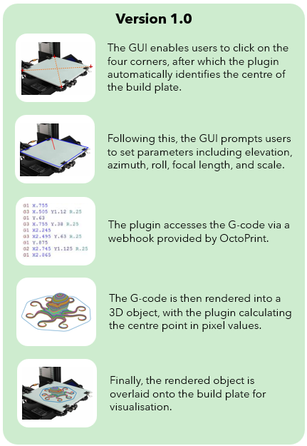

OctoPrint Hologram plugin
=========================
This plugin allows a user to an accurate preview of their print projected onto the build plate.

Example Usage
-------------

Future plans
------------
To automatically detect failures and defects in real-time by cross comparing the rendered model with the actual print, layer by layer.
Apon detection it will send a notification and pause/stop the print job.

Acknowledgments
-------------
I would like to give credit Yaqi Zhang’s for using their script for part of the Gcode rendering function.
https://github.com/zhangyaqi1989/Gcode-Reader