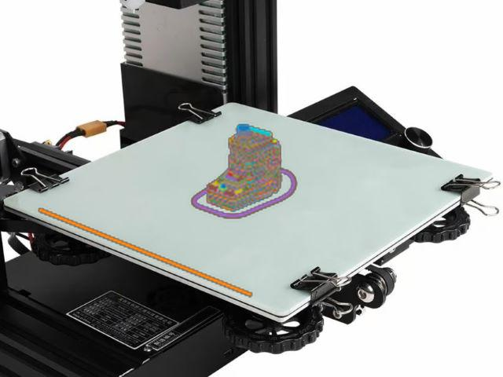
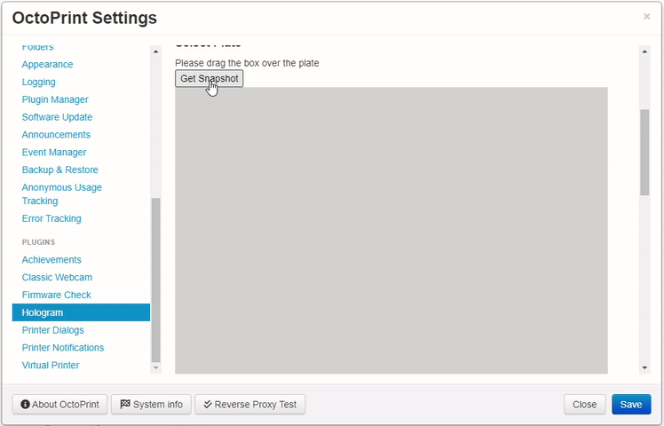

OctoPrint Hologram plugin
=========================
This plugin allows a user to an accurate preview of their print projected onto the build plate. Designed for cameras mounted on the build plates.

Example Usage
-------------
Generate a render by loading the print file, clicking the render button and it overlays a render onto the build plate.

Setup
-----
Position the box over the build plate and secure it to initiate the calibration process.

Make any necessary adjustments. Ensure the arrow points towards the origin.

Raspberry Pi
------------
Since this plugin depends on Numpy you many have to run the following.
- sudo apt-get install libopenblas-base
- sudo ldconfig

See: https://numpy.org/devdocs/user/troubleshooting-importerror.html

Future plans
------------
To automatically detect failures and defects in real-time by cross comparing the rendered model with the actual print, layer by layer. If a certain confidence level is met, the print will be paused. Check the pre-releases for more information.

Acknowledgments
-------------
I would like to give credit Yaqi Zhang’s for using their script for part of the Gcode rendering function.
https://github.com/zhangyaqi1989/Gcode-Reader